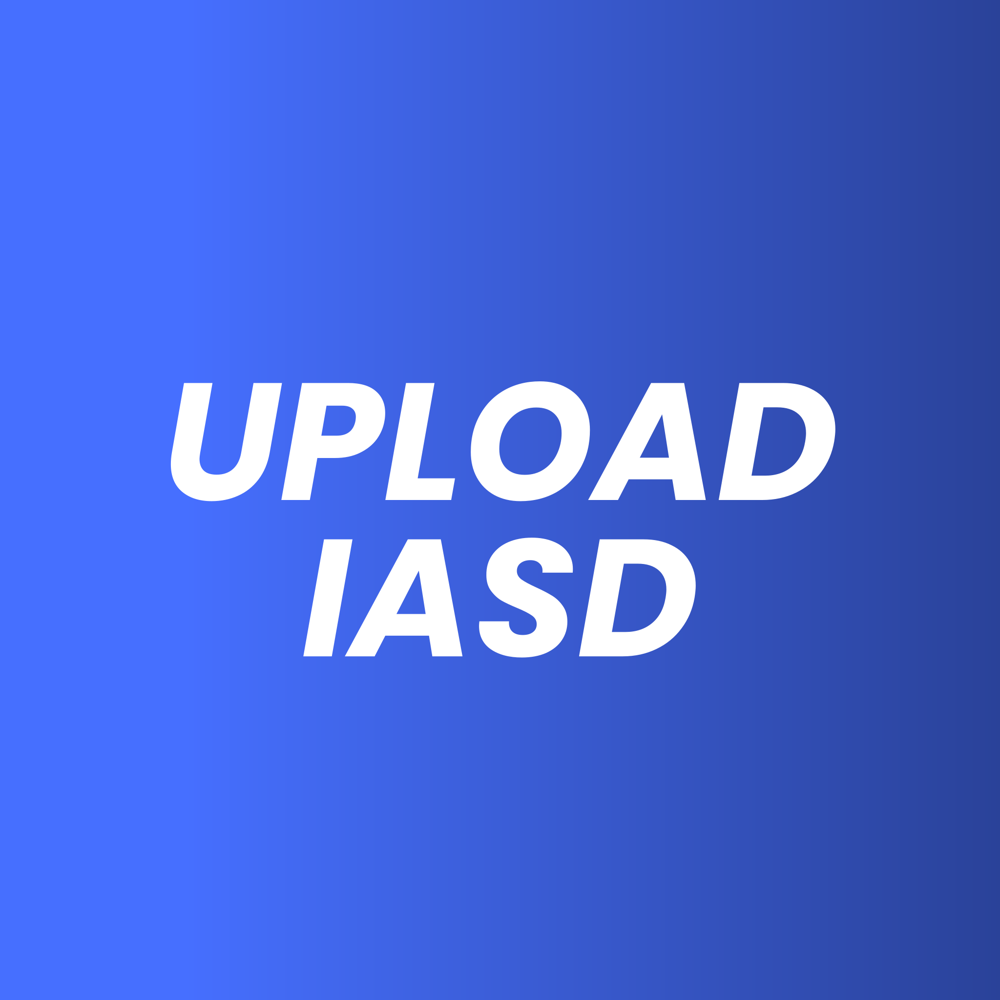

<div align="center">

# Upload IASD Desktop



**Versão 2.2.0**

Um aplicativo desktop desenvolvido para facilitar o upload e download de arquivos, especialmente voltado para sonoplastas e técnicos de som de igrejas.

[](https://www.microsoft.com/windows)
[](https://github.com/gabrielkramermota/UPLOAD-IASD/releases)
[](LICENSE)

[📥 Download](#-instalação) • [📖 Documentação](#-funcionalidades) • [🐛 Suporte](#-problemas-e-suporte)

</div>

---

## 📋 Índice

- [✨ Funcionalidades](#-funcionalidades)
- [📸 Documentação Visual](#-documentação-visual)
- [📥 Instalação](#-instalação)
- [🎯 Funcionalidades Detalhadas](#-funcionalidades-detalhadas)
- [🛠️ Desenvolvimento](#️-desenvolvimento)
- [👤 Autor](#-autor)

---

## ✨ Funcionalidades

### 📊 Dashboard
Visualize estatísticas completas do sistema em tempo real: total de atividades, tamanho dos arquivos, gráficos de atividades por data e distribuição por tipo. Controle tudo de um só lugar!

### 🎬 Download do YouTube
Baixe vídeos e áudios do YouTube em diferentes qualidades, com interface intuitiva, visualização de thumbnail e informações automáticas do vídeo. Organização automática por data e tipo.

### 💬 Bot WhatsApp Integrado
Receba arquivos via WhatsApp automaticamente. Conecte facilmente escaneando o QR Code e receba arquivos enviados para o bot com comandos simples.

### 📤 Servidor de Upload Local
Servidor HTTP local para receber uploads via navegador. Suporte para arquivos grandes (até 10GB), PDFs e todos os tipos de documentos. Acesse de qualquer dispositivo na mesma rede.

### 📋 Histórico de Atividades
Visualize todo o histórico de arquivos recebidos e baixados. Filtre por tipo (Upload, YouTube, WhatsApp), veja detalhes de cada arquivo e acesse rapidamente suas pastas.

### 📝 Logs do Sistema
Acesse logs completos do sistema para monitoramento e diagnóstico. Visualize atividades em tempo real com interface clara, copie logs para análise e monitore o funcionamento do aplicativo.

### 🔄 Atualizações Automáticas
O sistema verifica automaticamente por atualizações e notifica quando novas versões estão disponíveis, com download direto.

### 🎨 Interface Moderna
Interface intuitiva, responsiva e totalmente personalizável. Configure cores, logo e pastas de destino. Tutorial interativo para novos usuários.

---

## 📸 Documentação Visual

### Tela Inicial


A tela inicial permite iniciar o servidor de upload para receber arquivos enviados pelo navegador do celular ou computador.

### Bot WhatsApp


Interface para gerenciar o bot do WhatsApp, visualizar QR Code e monitorar o status da conexão.

### Download de Vídeo do YouTube


Baixe vídeos e músicas do YouTube facilmente, escolhendo a qualidade desejada. Visualize thumbnail e informações do vídeo antes de baixar.

### Configurações


Personalize o sistema: nome da igreja, cor do tema, logo e pastas de destino.

### Sobre o Sistema


Informações sobre o sistema, versão e desenvolvedor.

---

## 📥 Instalação

### Requisitos do Sistema

- **Windows 10 ou superior**
- **Node.js 18+** (necessário apenas para o bot WhatsApp)
  - Download: https://nodejs.org/
  - ⚠️ O app funciona sem Node.js, mas o bot WhatsApp não estará disponível

### Opções de Instalação

#### 🎯 Opção 1 - Instalador MSI (Recomendado)

1. Baixe o arquivo `Upload-IASD-Desktop_2.2.0_x64_en-US.msi` da [página de releases](https://github.com/gabrielkramermota/UPLOAD-IASD/releases)
2. Execute o arquivo baixado
3. Siga o assistente de instalação
4. O app aparecerá no menu Iniciar do Windows com atalhos criados automaticamente

#### 📦 Opção 2 - Instalador NSIS

1. Baixe o arquivo `Upload-IASD-Desktop_2.2.0_x64-setup.exe` da [página de releases](https://github.com/gabrielkramermota/UPLOAD-IASD/releases)
2. Execute o arquivo e siga o assistente de instalação

#### 💾 Opção 3 - Executável Portátil

1. Baixe o arquivo `uploadiasddesktop.exe` da [página de releases](https://github.com/gabrielkramermota/UPLOAD-IASD/releases)
2. Execute diretamente (não requer instalação)
3. Pode ser executado de qualquer pasta

### ⚠️ Aviso do Windows Defender

Na primeira execução, o Windows pode exibir um aviso de segurança:
> "Windows protegeu seu PC"

**Isso é normal** para aplicativos não assinados digitalmente. Para executar:
1. Clique em "Mais informações"
2. Clique em "Executar mesmo assim"

---

## 🎯 Funcionalidades Detalhadas

### 🎬 Download do YouTube

- ✅ Baixe vídeos em múltiplas qualidades (240p até 2160p ou melhor disponível)
- ✅ Extraia apenas o áudio em formato MP3
- ✅ Visualize thumbnail e informações do vídeo antes de baixar
- ✅ Busca automática de informações do vídeo ao inserir a URL
- ✅ Organize downloads em pasta configurável
- ✅ Interface intuitiva e amigável
- ✅ Qualidade padrão: "Melhor disponível"

### 💬 Bot WhatsApp

- ✅ Receba arquivos via WhatsApp automaticamente
- ✅ QR Code para conectar sua conta facilmente
- ✅ Cache limpo automaticamente ao encerrar
- ✅ Mensagens de status em tempo real
- ✅ Registro automático de atividades no histórico

**Comandos disponíveis:**
- `!upload [nome]` ou `!arquivo [nome]` - Faz upload da mídia anexada
- `!links [nome] [link1] [link2] ...` - Salva links em arquivo de texto
- `!ajuda` - Mostra lista de comandos

### 📤 Servidor de Upload Local

- ✅ Servidor HTTP na porta 8080
- ✅ Interface web para upload de arquivos
- ✅ Receba uploads de qualquer dispositivo na mesma rede
- ✅ Suporte para múltiplos arquivos simultâneos
- ✅ Suporte para arquivos grandes (até 10GB)
- ✅ Suporte para PDFs e todos os tipos de documentos
- ✅ Sanitização automática de nomes de arquivo
- ✅ Visualização do IP local para acesso
- ✅ Timeout estendido para uploads grandes (30 minutos)
- ✅ Logs detalhados durante o processo

### 📊 Dashboard e Estatísticas

- ✅ Visão geral das atividades do sistema
- ✅ Gráficos de atividades dos últimos 7 dias
- ✅ Estatísticas por tipo de atividade
- ✅ Total de arquivos e tamanho total
- ✅ Lista de atividades recentes
- ✅ Atualização automática em tempo real

### 📋 Histórico de Atividades

- ✅ Lista completa de todos os uploads e downloads
- ✅ Filtros por tipo (Upload, YouTube, WhatsApp)
- ✅ Informações detalhadas (nome, tamanho, data, origem)
- ✅ Acesso rápido às pastas dos arquivos (abre no explorador)
- ✅ Limite configurável de registros exibidos (25, 50, 100, 200)
- ✅ Organização cronológica (mais recente primeiro)
- ✅ Validação de caminhos antes de abrir

### 📝 Logs e Debug

- ✅ Visualização de logs do sistema em tempo real
- ✅ Destaque por nível (erro, aviso, info) com cores
- ✅ Copiar logs individuais ou todos de uma vez
- ✅ Auto-refresh a cada 5 segundos
- ✅ Limite configurável de linhas exibidas
- ✅ Interface com background claro para melhor legibilidade
- ✅ Ordenação correta (mais recentes primeiro)

### 🔄 Sistema de Atualizações

- ✅ Verificação automática ao iniciar o app
- ✅ Verificação periódica em background
- ✅ Notificações quando novas versões estão disponíveis
- ✅ Verificação manual na página "Sobre"
- ✅ Download direto da nova versão
- ✅ Informações completas da release

### ⚙️ Configurações e Personalização

- ✅ Personalize o nome da igreja
- ✅ Escolha a cor do tema
- ✅ Adicione o logo da sua igreja
- ✅ Configure pastas de destino para uploads e vídeos
- ✅ Abertura rápida das pastas configuradas
- ✅ Tutorial interativo para novos usuários
- ✅ Botão para rever o tutorial a qualquer momento

### 📋 Funcionalidades por Requisito

#### ✅ Funciona SEM Node.js
- Dashboard e estatísticas
- Histórico de atividades
- Logs do sistema
- Download de vídeos do YouTube
- Servidor de upload local
- Interface e configurações
- Sistema de atualizações
- Todas as funcionalidades básicas

#### ✅ Funciona COM Node.js
- Todas as funcionalidades acima
- **+ Bot WhatsApp integrado**

---

## 🛠️ Desenvolvimento

### Pré-requisitos

- Node.js 18+
- Rust (instalado automaticamente pelo Tauri)
- Git

### Instalação para Desenvolvimento

```bash
# Clone o repositório
git clone https://github.com/gabrielkramermota/UPLOAD-IASD.git
cd upload.iasd.desktop

# Instale as dependências
npm install

# Execute em modo desenvolvimento
npm run tauri dev
```

### Build para Produção

```bash
# Build do frontend
npm run build

# Build do executável
npm run tauri build
```

Os arquivos gerados estarão em:
- **Executável**: `src-tauri/target/release/uploadiasddesktop.exe`
- **Instalador MSI**: `src-tauri/target/release/bundle/msi/Upload-IASD-Desktop_2.2.0_x64_en-US.msi`
- **Instalador NSIS**: `src-tauri/target/release/bundle/nsis/Upload-IASD-Desktop_2.2.0_x64-setup.exe`

---

## 📝 Notas Importantes

- **Primeira execução**: Tela de boas-vindas e tutorial interativo
- **yt-dlp**: Será baixado automaticamente na primeira vez que usar o download do YouTube
- **Cache do Bot**: É limpo automaticamente ao parar o bot WhatsApp
- **Pastas padrão**: 
  - Uploads: `%LocalAppData%\UploadIASD\uploads`
  - Vídeos: `%UserProfile%\Downloads\UploadIASD`
- **Arquivos grandes**: Suporte para uploads de até 10GB
- **Timeout**: Timeout de 30 minutos para uploads grandes
- **Permissões**: O app solicita permissões necessárias automaticamente

---

## 🐛 Problemas e Suporte

Se encontrar algum problema:

1. Verifique se atende aos requisitos do sistema
2. Verifique se o Node.js está instalado (para o bot WhatsApp)
3. Consulte a seção de [Notas Importantes](#-notas-importantes)
4. Verifique os logs do sistema na página de Logs
5. Abra uma [issue no GitHub](https://github.com/gabrielkramermota/UPLOAD-IASD/issues)

---

## 📄 Licença

Este projeto é de código aberto e está disponível sob a licença MIT.

---

## 👤 Autor

<div align="center">

**Gabriel Kramer Mota**

[](https://github.com/gabrielkramermota)
[](mailto:kramermota55@gmail.com)

Desenvolvido com ❤️ para a comunidade

</div>

---

## 🙏 Agradecimentos

- [Tauri](https://tauri.app/) - Framework para aplicativos desktop
- [React](https://react.dev/) - Biblioteca JavaScript
- [yt-dlp](https://github.com/yt-dlp/yt-dlp) - Ferramenta de download do YouTube
- [whatsapp-web.js](https://github.com/pedroslopez/whatsapp-web.js) - Biblioteca do WhatsApp

---

<div align="center">

**Versão 2.2.0** • **Última atualização:** Janeiro 2026

[⬆️ Voltar ao topo](#-upload-iasd-desktop)

</div>
