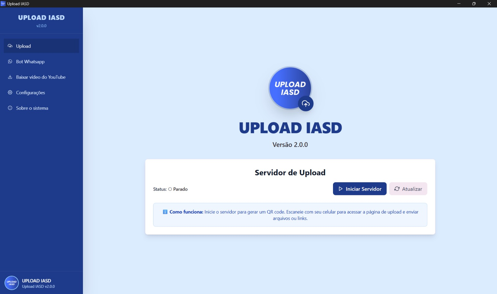
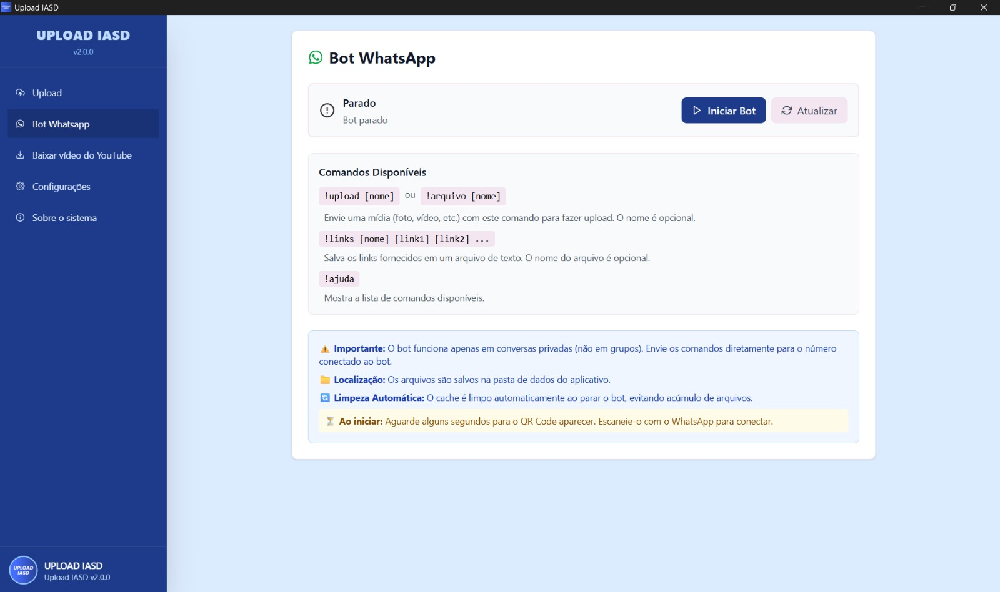
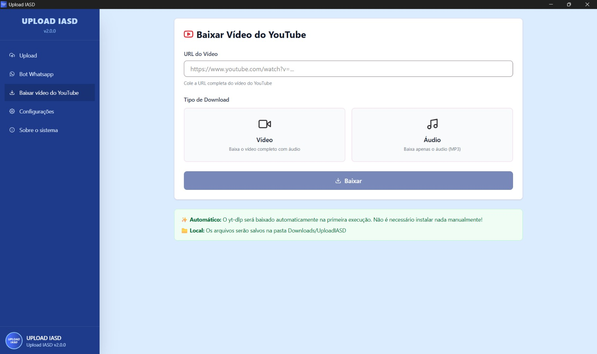
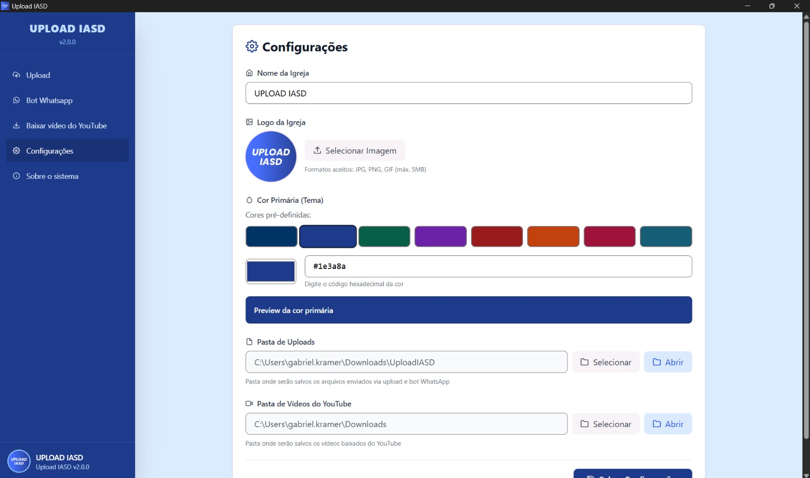
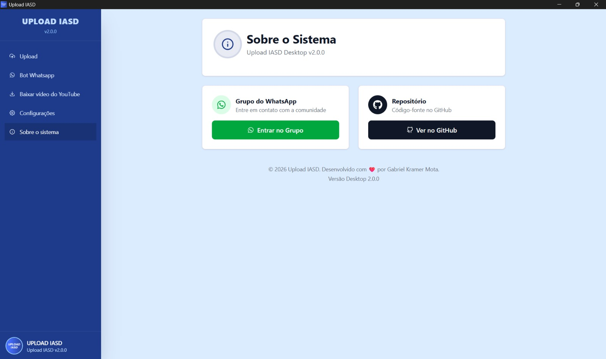

# 📤 Upload IASD Desktop

Um aplicativo desktop desenvolvido para facilitar o upload e download de arquivos, especialmente voltado para sonoplastas e técnicos de som de igrejas.

## 🚀 Funcionalidades

- ✅ **Download de Vídeos do YouTube** - Baixe vídeos e áudios do YouTube em diferentes qualidades
- ✅ **Bot WhatsApp Integrado** - Receba arquivos via WhatsApp automaticamente
- ✅ **Servidor de Upload Local** - Servidor HTTP local para receber uploads via navegador
- ✅ **Interface Moderna** - Interface intuitiva e responsiva
- ✅ **Configurações Personalizáveis** - Configure pastas de destino e preferências

## 📸 Documentação Visual

### Tela Inicial


### Bot Whatsapp


### Download de Vídeo do Youtube


### Configurações


### Sobre o sistema


## 📥 Instalação

### Requisitos do Sistema
- Windows 10 ou superior
- Node.js 18+ (necessário apenas para o bot WhatsApp)
  - Download: https://nodejs.org/
  - O app funciona sem Node.js, mas o bot WhatsApp não estará disponível

### Opções de Instalação

#### Opção 1 - Instalador MSI (Recomendado)
1. Baixe o arquivo `uploadiasddesktop_2.0.0_x64_en-US.msi` da [página de releases](https://github.com/gabrielkramermota/UPLOAD-IASD/releases)
2. Execute o arquivo baixado
3. Siga o assistente de instalação
4. O app aparecerá no menu Iniciar do Windows

#### Opção 2 - Instalador NSIS
1. Baixe o arquivo `uploadiasddesktop_2.0.0_x64-setup.exe` da [página de releases](https://github.com/gabrielkramermota/UPLOAD-IASD/releases)
2. Execute o arquivo e siga o assistente de instalação

#### Opção 3 - Executável Portátil
1. Baixe o arquivo `uploadiasddesktop.exe` da [página de releases](https://github.com/gabrielkramermota/UPLOAD-IASD/releases)
2. Execute diretamente (não requer instalação)
3. Pode ser executado de qualquer pasta

## ⚠️ Aviso do Windows Defender

Na primeira execução, o Windows pode exibir um aviso de segurança:
> "Windows protegeu seu PC"

**Isso é normal** para aplicativos não assinados digitalmente. Para executar:
1. Clique em "Mais informações"
2. Clique em "Executar mesmo assim"

## 🎯 Funcionalidades Detalhadas

### Download do YouTube
- Baixe vídeos em múltiplas qualidades (240p até 2160p)
- Extraia apenas o áudio em formato MP3
- Visualize informações do vídeo antes de baixar
- Organize downloads em pasta configurável

### Bot WhatsApp
- Receba arquivos via WhatsApp automaticamente
- Envie comandos para fazer upload de mídias
- QR Code para conectar sua conta
- Cache limpo automaticamente ao encerrar

**Comandos disponíveis:**
- `!upload [nome]` ou `!arquivo [nome]` - Faz upload da mídia anexada
- `!links [nome] [link1] [link2] ...` - Salva links em arquivo de texto
- `!ajuda` - Mostra lista de comandos

### Servidor de Upload Local
- Servidor HTTP na porta 8080
- Interface web para upload de arquivos
- Receba uploads de qualquer dispositivo na mesma rede
- Suporte para múltiplos arquivos

## 📋 Funcionalidades por Requisito

### ✅ Funciona SEM Node.js
- Download de vídeos do YouTube
- Servidor de upload local
- Interface e configurações
- Todas as funcionalidades básicas

### ✅ Funciona COM Node.js
- Todas as funcionalidades acima
- **+ Bot WhatsApp integrado**

## 🛠️ Desenvolvimento

### Pré-requisitos
- Node.js 18+
- Rust (instalado automaticamente pelo Tauri)
- Git

### Instalação para Desenvolvimento

```bash
# Clone o repositório
git clone https://github.com/gabrielkramermota/UPLOAD-IASD.git
cd upload.iasd.desktop

# Instale as dependências
npm install

# Execute em modo desenvolvimento
npm run tauri dev
```

### Build para Produção

```bash
# Build do frontend
npm run build

# Build do executável
npm run tauri build
```

Os arquivos gerados estarão em:
- Executável: `src-tauri/target/release/uploadiasddesktop.exe`
- Instalador MSI: `src-tauri/target/release/bundle/msi/`
- Instalador NSIS: `src-tauri/target/release/bundle/nsis/`

## 📝 Notas Importantes

- **Primeira execução**: Pode demorar alguns segundos para inicializar
- **yt-dlp**: Será baixado automaticamente na primeira vez que usar o download do YouTube
- **Cache do Bot**: É limpo automaticamente ao parar o bot WhatsApp
- **Pastas padrão**: 
  - Uploads: `%LocalAppData%\UploadIASD\uploads`
  - Vídeos: `%UserProfile%\Downloads\UploadIASD`

## 🐛 Problemas e Suporte

Se encontrar algum problema:
1. Verifique se atende aos requisitos do sistema
2. Verifique se o Node.js está instalado (para o bot WhatsApp)
3. Abra uma [issue no GitHub](https://github.com/gabrielkramermota/UPLOAD-IASD/issues)

## 📄 Licença

Este projeto é de código aberto e está disponível sob a licença MIT.

## 👤 Autor

**Gabriel Kramer Mota**
- GitHub: [@gabrielkramermota](https://github.com/gabrielkramermota)
- Email: kramermota55@gmail.com

## 🙏 Agradecimentos

- [Tauri](https://tauri.app/) - Framework para aplicativos desktop
- [React](https://react.dev/) - Biblioteca JavaScript
- [yt-dlp](https://github.com/yt-dlp/yt-dlp) - Ferramenta de download do YouTube
- [whatsapp-web.js](https://github.com/pedroslopez/whatsapp-web.js) - Biblioteca do WhatsApp

---

**Versão:** 2.0.0  
**Última atualização:** 2026
